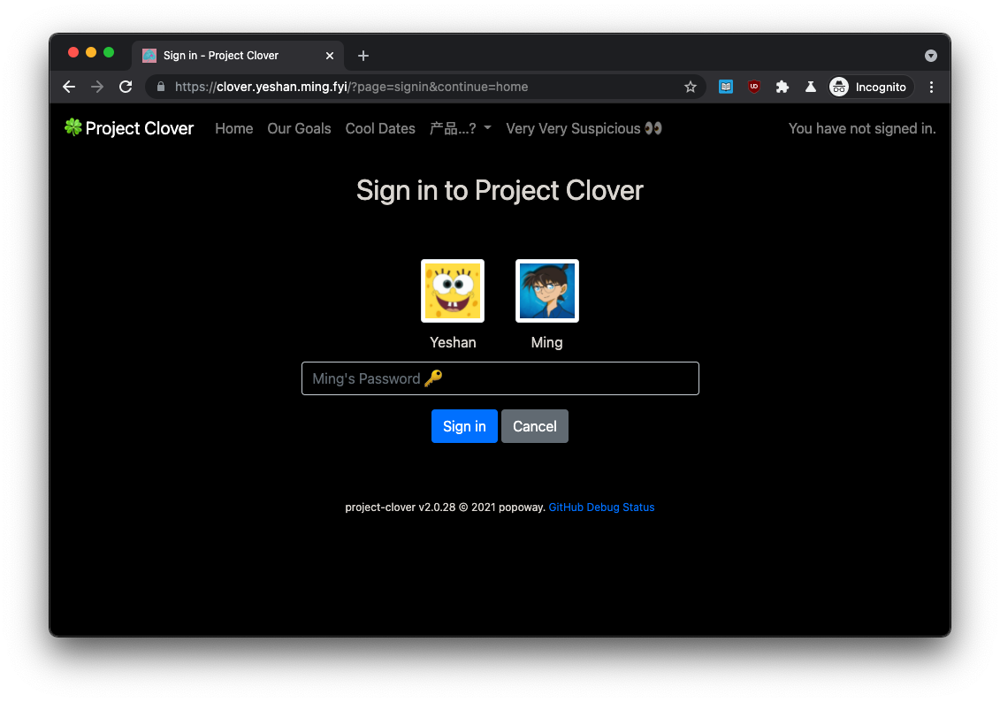

# project-clover

  

Who's the Queen of vday20?

## Quick Links
Production: https://clover.yeshan.ming.fyi  
Staging: https://staging.clover.yeshan.ming.fyi 

## Motivation

We were thinking about getting an app / service to store our memories. Then it turned out that those apps on various markets are not that good, plus there are privacy and customization issues, etc. So here is the present for vday20.

## Self-hosting

Everything you need to host this app on your server is any server with PHP and MySQL installed. The app consists of a few php files, an installation / migration [script](https://github.com/popoway/project-clover/tree/master/update), and static assets. You can download the latest distribution files from the [release page](https://github.com/popoway/project-clover/releases).

## Compatibility
|  IE / Edge |  Firefox |  Chrome |  Safari |  iOS Safari |
| --------- | --------- | --------- | --------- | --------- |
| last 3 versions| last 2 versions| last 3 versions| last 2 versions| last 2 versions

## TODO
[TODO](https://github.com/popoway/project-clover/wiki/TODO)

## License
All logos and trademarks are the property of their respective owners.

Everything else is available under the [MIT license](https://popoway.mit-license.org/).
